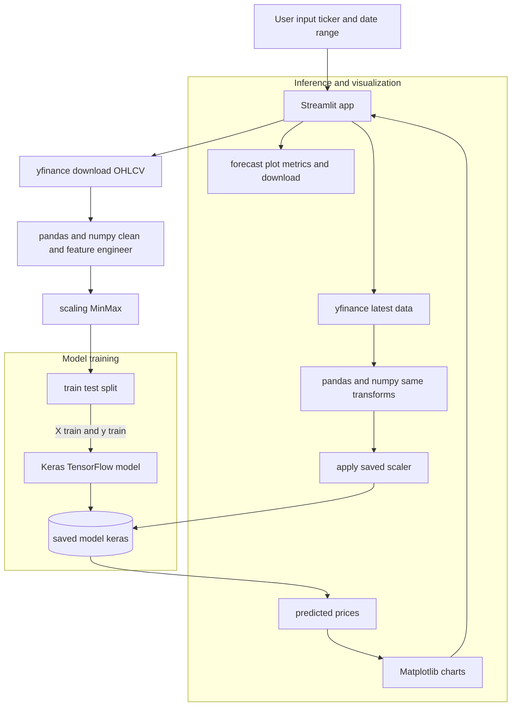

# 📈 Stock Price Prediction using Machine Learning

This project demonstrates a **Machine Learning workflow** for predicting stock prices using historical data.  
It includes data preprocessing, model training, evaluation, and making predictions with a trained model.

---

## 🚀 Project Structure

- **main.py** – Python script for training and running the ML model.  
- **ML.ipynb** – Jupyter notebook for experimentation, visualization, and model testing.  
- **stock_predictions_model.keras** – Pre-trained Keras model for stock price prediction.  
- **ml_workflow.png** – Workflow diagram for the project.  

---

## ⚙️ Workflow

1. **Stock Data Collection** – Gather historical data (e.g., from Yahoo Finance APIs).  
2. **Data Preprocessing** – Clean, scale, and split data into training/testing sets.  
3. **Feature Engineering** – Create time windows and input sequences for training.  
4. **Model Training** – Train a deep learning model (LSTM/ANN) using Keras/TensorFlow.  
5. **Model Evaluation** – Assess model accuracy and loss metrics.  
6. **Prediction** – Forecast future stock prices using the trained model.  

---

## 🏗️ Architecture

---

## 🛠️ Tech Stack

- **Python** (NumPy, Pandas, Matplotlib, Scikit-learn)  
- **TensorFlow / Keras** for deep learning  
- **Jupyter Notebook** for experimentation  
- **GitHub** for version control  

---

