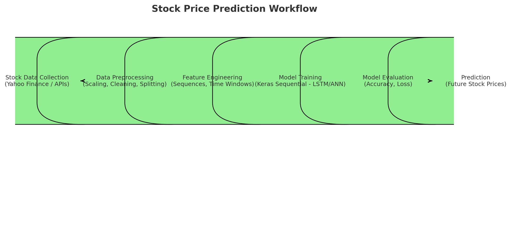

# 📈 Stock Price Prediction using Machine Learning

This project demonstrates a **Machine Learning workflow** for predicting stock prices using historical data.  
It includes data preprocessing, model training, evaluation, and making predictions with a trained model.

---

## 🚀 Project Structure

- **main.py** – Python script for training and running the ML model.  
- **ML.ipynb** – Jupyter notebook for experimentation, visualization, and model testing.  
- **stock_predictions_model.keras** – Pre-trained Keras model for stock price prediction.  

---

## ⚙️ Workflow

1. **Data Collection** – Gather historical stock data.  
2. **Data Preprocessing** – Clean, scale, and prepare data for model training.  
3. **Model Training** – Train a deep learning model using Keras/TensorFlow.  
4. **Model Evaluation** – Assess accuracy, loss, and performance metrics.  
5. **Prediction** – Generate future stock price predictions.  

---

## 📊 Machine Learning Workflow



---

## 🛠️ Tech Stack

- **Python** (NumPy, Pandas, Matplotlib, Scikit-learn)  
- **TensorFlow / Keras** for deep learning  
- **Jupyter Notebook** for experimentation  
- **GitHub** for version control  

---

## ▶️ How to Run

1. Clone the repository:
   ```bash
   git clone https://github.com/your-username/stock-price-prediction.git
   cd stock-price-prediction